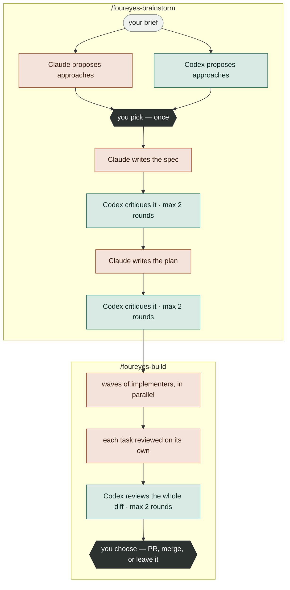

# foureyes

> **Claude writes the code. Codex reviews it.**

A [Claude Code](https://docs.claude.com/en/docs/claude-code) plugin that runs your
development pipeline across two model families. Claude designs, plans and writes.
OpenAI's Codex reads every spec, plan and diff it produces — in a read-only
sandbox, never having seen how Claude got there — because a model checking its own
work tends to agree with itself.

```
/plugin marketplace add Sultan1993/foureyes
/plugin install foureyes@foureyes
```

**[▸ How it works, step by step](https://sultan1993.github.io/foureyes/)** — every
step of every command, who runs it, and what it produces. (Or open
`docs/index.html` after cloning.)

|            | writes                        | grades                             |
| ---------- | ----------------------------- | ---------------------------------- |
| **Claude** | specs, plans, code, commits   | *nothing it wrote itself*          |
| **Codex**  | *nothing — read-only sandbox* | every spec, every plan, every diff |

Build also runs a fast same-family check on each task as it lands, before Codex
sees the change as a whole. That one is a first pass, not the verdict — the
cross-vendor review is what happens before you are asked where the branch goes.

---

## Why a second model

Ask a model to check its own work and it tends to agree with itself. It repeats
the assumption that caused the problem, because from the inside the assumption is
invisible.

Running the critic on a different model family, from a different vendor, gives you
a reader that has to reconstruct your intent from the artifact instead of
remembering it. That is not a guarantee of catching more — it is a way of not
sharing the author's blind spots by default.

The split is structural rather than stylistic. Codex is invoked through
`codex exec -s read-only` and cannot edit, stage or commit anything. It reads, it
reports, and every fix stays on the Claude side.

## What a run looks like

One Claude session coordinates everything — it dispatches the workers, owns every
commit, and decides what to do with each review. This README calls it *the
coordinator*.



The two proposal steps run **at the same time and blind** — neither model sees the
other's answer, which is the only moment their independence is worth anything.
Everything after that alternates: Claude writes, Codex reads, Claude revises.

## The commands

Five, and each is independent. Plan today and build next week, or review a pull request
without ever having used the others.

| command | what it is for | stops for you | roughly |
| --- | --- | --- | --- |
| `/foureyes-brainstorm` | turn an idea into a plan you can execute | once | 15–30 min |
| `/foureyes-build` | execute a plan, or take an idea to a finished branch | twice | 20–90 min |
| `/foureyes-review` | two independent reviews of a diff, and where they disagree | only to post | 10–20 min |
| `/foureyes-investigate` | find the cause of a bug, starting from almost nothing | never | 15–25 min |
| `/foureyes-ledger` | report whether the second model is earning its cost | never | seconds |

### /foureyes-brainstorm

```
/foureyes-brainstorm add offline support to the sync layer
```

Two models propose approaches without seeing each other. Their suggestions are
pooled into one file untouched, then ranked and capped at three — nothing reaches
the menu that neither model proposed. You pick once. The design spec and the
task-by-task plan are then written and critiqued twice each, and it **stops**.
Building is a separate decision, and the plan is rendered as an HTML page you can
actually read.

### /foureyes-build

```
/foureyes-build docs/foureyes/plans/2026-08-15-offline-sync.md
/foureyes-build add offline support to the sync layer      # plans first
```

Tasks whose file lists do not overlap run **concurrently** in one working tree.
Straightforward tasks go to a smaller, cheaper model; ones needing design
judgement go to a larger one. Each task is committed on its own and reviewed on
its own — then Codex sees the whole change together, which is the first time
anyone does. It works on a branch and never merges or pushes without asking.

### /foureyes-review

```
/foureyes-review          # current branch against its merge-base
/foureyes-review 142      # pull request #142
```

Both families review the same diff from a **byte-identical prompt**, across
correctness, security, performance, tests, API design and over-engineering. Then
each tries to knock down what only the other found. What survives being attacked
is what reaches you. Advisory throughout: it never merges, never edits, and never
posts a comment without confirming.

### /foureyes-investigate

```
/foureyes-investigate the auth flow feels flaky sometimes
```

Vague input is the expected input. Four scouts sweep the codebase at once from
different angles — what changed recently, where errors get swallowed, the area you
named, what touches the same data — and are forbidden from guessing at causes.
Both models then form hypotheses blind, each carrying *the cheapest observation
that would prove it wrong*, and those observations are actually run.

You get a cause with the evidence that proves it, or an honest `NOT ESTABLISHED`
plus everything now ruled out. It diagnoses only: it changes no code.

## What it guarantees

Each of these is checked by the test suite that ships with the plugin. Clone the
repo and run `bash tests/run.sh` — no model calls, a few seconds.

- **Codex cannot write.** Every call runs in a read-only sandbox. There is no mode
  in which the reviewer edits your code.
- **Only the coordinator commits.** Concurrent implementers share one working tree,
  so none of them may touch git. Work is committed at the join, one commit per
  task, scoped to that task's own files.
- **Every critic loop ends.** A reviewer reading a document again always finds one
  more thing. Each stage is capped at two passes, after which the author revises
  once and the pipeline moves on. The cap, not agreement, is what ends it.
- **Agreement is never proof.** Two models liking the same answer is a signal, not
  a verdict. In `investigate`, a hypothesis is settled only by an observation that
  could have disproved it.
- **Findings are recorded with their outcome** — fixed, kept deliberately, or
  checked and found false — alongside what the round cost.
- **No other plugin required.**

### What the Claude side can do

Codex being read-only is only half the picture. Claude *does* write files, run
your build and tests, and create commits — on a branch it creates, never on your
default branch, and never merging or pushing unless you say so. It refuses to
start on a dirty working tree.

## Requirements

- **Claude Code**, and a git repository.
- **The Codex CLI**, signed in:
  ```
  npm install -g @openai/codex
  codex login
  ```
- **An account with each vendor** — a Claude Code subscription, and a ChatGPT or
  API account for Codex.
- **`gh`** (GitHub CLI), signed in, only for `/foureyes-review <PR#>`.

**What a run costs in Codex calls.** `brainstorm` makes up to five: one approach
proposal, then up to two reviews each of the spec and the plan. `build` from a
plan adds up to two more; `build` from an idea does both. `review` makes one per
model plus one per contested finding. Each is a fresh high-effort call, typically
a few minutes.

Without Codex the commands still run if you pass `--skip-critics`, but only one
model family is involved and the cross-checking — the reason to install this — is
gone.

> **Your code goes to two vendors, not one.** Whatever the commands read — source,
> diffs, commit history — is sent to Anthropic *and* to OpenAI, each under its own
> terms and retention policy. If your repository cannot be shared with a second
> provider, this plugin is not for it.

## Install

```
/plugin marketplace add Sultan1993/foureyes
/plugin install foureyes@foureyes
```

Update later:

```
claude plugin marketplace update foureyes
claude plugin update foureyes@foureyes
```

Restart Claude Code after updating, so the new skills register. To remove it:
`/plugin uninstall foureyes@foureyes`.

Uninstalling removes the plugin only. Anything it wrote into your repository under
`docs/foureyes/` stays — those are your specs, plans and reports — as does
`~/.claude/foureyes-repos` if you created one.

## What it writes into your repository

Artifacts are committed alongside your code on purpose — they are reviewable in
the same pull request as the change they describe.

```
docs/foureyes/
├── specs/           design specs, and the approach menus behind them
├── plans/           task-by-task plans, plus the .tasks.json the executor runs
└── investigations/  investigation reports
```

Run artifacts — diffs, intermediate output — go inside `.git/` instead, so they
never show up in `git status`.

## Configuration

Optional environment variables, all with working defaults.

| | default | effect |
| --- | --- | --- |
| `CODEX_CRITIC_SPEED` | `fast` | priority routing: same thinking, sooner, more per token. `normal` opts out |
| `CODEX_CRITIC_EFFORT` | `high` | reasoning depth — `minimal` … `high` … `xhigh` |
| `CODEX_CRITIC_SEARCH` | `1` | live web search, so a critic can check a library claim against current docs |
| `CODEX_CRITIC_MODEL` | `gpt-5.6-sol` | empty string uses your account default |
| `CODEX_CRITIC_MAX_ROUNDS` | `2` | passes per review stage |

Claude-side effort is pinned per role in each agent's frontmatter, because the
Agent tool has no effort parameter: mechanical and standard work runs on Sonnet at
medium, design judgement on Opus at high.

Specs and plans are drafted on Claude's frontier model. If it is unavailable — a
spent quota, most often — drafting falls back to Opus and says so in the
transcript rather than failing the run.

## Is Codex earning its keep?

Every review stage logs its findings and what became of each one, with the time
the round took. `/foureyes-ledger` reads those back:

```
seam    raised  fixed  rejected  intentional  open   acted-on
spec        18     11         4            2     1        72%
plan        12      9         1            2     0        92%
code         7      5         2            0     0        71%
```

`rejected` means the critic was factually wrong and the round was spent anyway. A
stage whose acted-on rate stays low is a stage worth cutting — the instrument
exists so that call is made on evidence rather than on feel.

## The full walkthrough

[**sultan1993.github.io/foureyes**](https://sultan1993.github.io/foureyes/) lays
out all five commands, all forty steps, who executes each one and on which model —
with the shared skeleton shown as a grid so you can read across it. The page lives
in this repo at `docs/index.html`; nothing is fetched from anywhere else, so it
also works offline straight from a clone.

## Running the tests

```
bash tests/run.sh
```

Six suites, no model calls, a few seconds. Most of this plugin is prose, and prose
regresses silently: an edit that sends a Codex-only reviewer to a Claude subagent
breaks the entire premise while every other test stays green. The suite asserts
the invariants the design rests on, never wording.

## License

MIT. Portions of the implementer and task-reviewer prompts are adapted from
[obra/superpowers](https://github.com/obra/superpowers) (MIT); each file records
what was changed and why.
